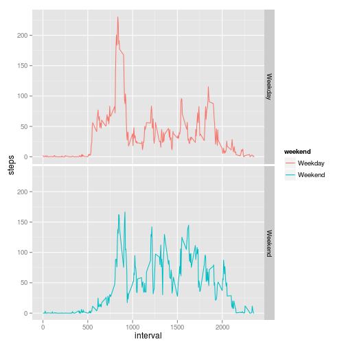

# Reproducible Research: Peer Assessment 1
This is a knitted document showing the solution to Peer Assessment 1 of the 
Reproducible Research course on Coursera.


## Loading and preprocessing the data
First, the data must be unzipped, loaded, and preprocessed.


```r
unzip("./activity.zip")
activity <- read.table("./activity.csv", sep=",", header=TRUE)
activity.clean <- activity[!is.na(activity[, 1]), ]
```

## What is mean total number of steps taken per day?
We will now analyze the mean number of steps per day.


```r
mean.steps <- tapply(activity.clean$steps, activity.clean$date, mean)
hist(mean.steps)
```

 

The mean number of steps taken per day is **37.3826**
and the median is **37.3785**


## What is the average daily activity pattern?

```r
mean.interval <- tapply(activity.clean$steps, activity.clean$interval, mean)
steps <- data.frame("Time"=as.numeric(names(mean.interval)), "Steps"=mean.interval)
plot(steps, type='l')
```

 

The maximum average number of steps across all the days occurs during the
interval **835**.

## Imputing missing values
There are missing values in the data set, found with the following:

```r
sum(is.na(activity))
```

```
## [1] 2304
```

The missing values will be imputed using the mean values for those 5-minute
intervals.


```r
for (i in 1:dim(activity)[1]){
    if (is.na(activity$steps[i])){
        activity$steps[i] <- steps[steps[, 1] == activity$interval[i], 2]
    }
}
```

Now we will repeat the histogram and see if the mean has changed.


```r
mean.steps <- tapply(activity$steps, activity$date, mean)
hist(mean.steps)
```

 

The mean number of steps taken per day is **37.3826**
and the median is **37.3826**   

We can see that the mean is the same, but now the *median has shifted to be
equal to the mean*.

## Are there differences in activity patterns between weekdays and weekends?


```r
activity$day <- weekdays(strptime((activity$date), "%Y-%m-%d"))
activity$weekend <- (activity$day =="Saturday" | 
                     activity$day=="Sunday")
weekend.means <- aggregate(activity$steps, 
                           by=list(activity$weekend, activity$interval), 
                           FUN=mean)
names(weekend.means) <- c("weekend", "interval", "steps")
weekend.means$weekend <- factor(weekend.means$weekend, 
                                labels=c("Weekday", "Weekend"))
library(ggplot2)
qplot(interval, steps, data=weekend.means, color=weekend, facets=weekend ~ ., 
      geom="line")
```

 

One can clearly see a difference in weekday and weekend activity. On weekdays,
there is much more activity centered around 6:00 AM, when the subject probably
is getting ready for work. However, there is less activity in general during
weekdays, as the subject may be stuck at a desk for his/her job.
